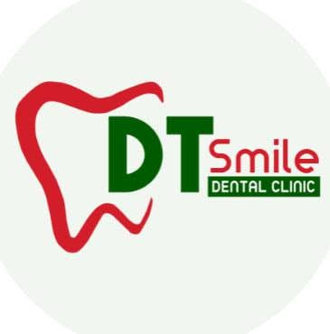

# DT Smile Dental Clinic  
## Patient Management System — Proposal Pack

**Clinic:** DT Smile Dental Clinic  
**Dentist-owner:** Doc Shelay  
**Team:** Doc Shelay + 1 receptionist/assistant  
**Goal:** Cloud clinic system

---

## What you get

A **cloud web app** you open on phone, tablet, or clinic PC:

| Module | Benefit |
|--------|---------|
| Appointment scheduling | Day/week calendar, chair/dentist slots, status tracking |
| Electronic patient records | Profile, visit notes, simple dental chart, file uploads |
| Billing & payments | Invoices, Cash/GCash/bank/card recording, balances |
| Prescriptions | Create, print/PDF, history per patient |
| Email appointment reminders | Auto email reminders before appointments |
| Reports dashboard | Revenue, no-shows, outstanding balances |
| Multi-user access | **Dentist** (full) + **Reception** (front desk) |
| Cloud storage & backup | DigitalOcean hosting with database + file backups |
| Technical support | Optional monthly retainer after go-live |

---

## Who uses it

| Role | Typical use |
|------|-------------|
| **Dentist (Doc Shelay)** | Charting, visit notes, prescriptions, reports, users/settings |
| **Reception** | Book/check-in patients, update profiles, collect payments |

---

## Timeline

**About 8–12 weeks** (discovery → build → training → go-live)

---

## Open the wireframes (live site)

GitHub’s repo page shows this README. The clickable prototype is on **GitHub Pages**:

**https://degarushiya.github.io/DT-Smile/**

That opens the wireframe app (not the README).
