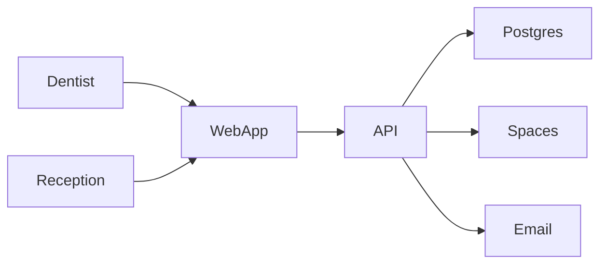

# System Specification  
## DT Smile Dental Clinic — Patient Management System

**Version:** 1.0 (Proposal)  
**Clinic:** DT Smile Dental Clinic (Philippines)  
**Dentist-owner:** Doc Shelay  
**Clinic model:** Solo dentist-owner + 1 receptionist/assistant  
**Branding:** Red + forest green (see `assets/dt-smile-logo.png`)  
**Problem framing:** Replace Google Sheets with a role-based clinic web app  

---

## 1. Goals

- One place for appointments, patient records, billing, and prescriptions  
- Usable on clinic desktop, tablet, and phone (responsive web)  
- Clear roles so reception can run the front desk without accessing dentist-only tools  
- Cloud storage with backups—no single Spreadsheet as the source of truth  
- Email reminders to reduce no-shows  

---

## 2. Users & roles

### 2.1 Dentist (Admin) — Doc Shelay

- Full access to all modules  
- Clinical: dental chart, visit notes, prescriptions  
- Admin: users, reminder templates, service prices, reports  
- Can void/adjust invoices (with audit note)  
- Display name in system: **Doc Shelay**  

### 2.2 Reception

- Appointments: create, reschedule, cancel, check-in  
- Patients: create/edit profile (demographics, contacts, allergies flag)  
- Billing: create invoices from services, record payments (Cash, GCash, bank transfer, card)  
- View today’s schedule and patient balances  
- **Cannot:** edit prescriptions, manage users, change system settings, delete clinical notes  

---

## 3. Modules

### 3.1 Appointment scheduling

- Day and week calendar views  
- Book by patient, date/time, dentist, chair (default: 1 chair), service, duration  
- Statuses: Scheduled → Confirmed → Arrived → In chair → Completed / No-show / Cancelled  
- Conflict check: no overlapping appointments for the same dentist/chair  
- Optional notify patient on book/reschedule (email)  

### 3.2 Electronic patient records (EPR)

- Patient ID, name, birthdate, sex, phone, email, address, emergency contact  
- Medical notes: allergies, conditions, medications (free text + flags)  
- Visit notes linked to appointments: chief complaint, exam, treatment done, next plan  
- Simple odontogram (tooth grid); click tooth → condition/treatment note  
- File uploads: X-ray images, consent PDFs, photos → cloud object storage  
- Search by name, phone, or patient ID  

### 3.3 Billing & payment monitoring

- Service catalog with prices in ₱ (e.g. Cleaning, Filling, Extraction, Consultation)  
- Invoice per visit (multiple line items allowed)  
- Discounts and notes  
- Record payments: method (Cash / GCash / Bank transfer / Card), amount, reference no.  
- Statuses: Unpaid / Partial / Paid  
- Patient balance and clinic “outstanding” list  
- Print or PDF receipt  
- **v1:** payment status tracking only—no GCash/Maya API gateway  

### 3.4 Prescription management

- Create Rx linked to patient + visit  
- Fields: drug, dose, frequency, days, quantity, instructions  
- Prescriber = logged-in dentist  
- Print / PDF; history tab on patient record  
- Reception: view-only (optional) or no Rx access—default **no create/edit** for Reception  

### 3.5 Email appointment reminders

- Configurable: e.g. email 48 hours before, optional same-day morning email  
- Templates in English/Taglish with placeholders: `{name}`, `{date}`, `{time}`, `{clinic}` (DT Smile Dental Clinic), `{phone}`  
- Default clinic display name: **DT Smile Dental Clinic**; from-name: **Doc Shelay / DT Smile Dental Clinic**  
- Provider assumption: SMTP or SendGrid/Mailgun  
- Log of sent emails (success/fail)  
- Requires a valid patient email on the record to send  

### 3.6 Reports & analytics dashboard

- Today’s appointment count, checked-in, pending pay, no-shows  
- Date-range: patients seen, appointments, revenue (₱), no-show rate  
- Revenue by service; outstanding balances list  
- Export CSV or PDF for simple accounting handoff  

### 3.7 Multi-user access

- Login with email/username + password  
- Role-based menus and API permissions  
- Dentist can invite/disable Reception users  

### 3.8 Cloud storage, multi-device, backup & security

- HTTPS web app hosted on DigitalOcean  
- Database: Managed PostgreSQL with automated backups  
- Files: DigitalOcean Spaces  
- Droplet weekly backups (starter)  
- Password hashing; session auth; HTTPS only  
- Practical audit log for invoice voids and clinical note edits  

### 3.9 Technical support (post-launch)

- Defined in budget as optional retainer (bug fixes, small tweaks, guidance)  
- Not a 24/7 hospital-grade SLA unless separately contracted  

---

## 4. Key user flows

### 4.1 Book and complete a visit (happy path)

1. Reception books appointment (or patient walks in → same-day slot)  
2. System sends confirmation email if enabled  
3. Reminder email fires before appointment  
4. Reception marks Arrived → Dentist marks In chair  
5. Dentist updates chart + visit note; creates Rx if needed  
6. Reception creates invoice, records payment (Cash/GCash/etc.)  
7. Appointment marked Completed  

### 4.2 Collect partial payment

1. Invoice total ₱4,000; patient pays ₱2,500 GCash  
2. Reception records payment + reference  
3. Status = Partial; balance ₱1,500 shows on patient and reports  

### 4.3 No-show

1. Patient does not arrive  
2. Reception/Dentist marks No-show  
3. Counts toward no-show report; optional follow-up email later (manual or future feature)  

---

## 5. Architecture (proposed implementation)

| Layer | Choice (proposal default) |
|-------|---------------------------|
| Clients | Responsive web (desktop + mobile browsers) |
| Hosting | DigitalOcean Basic Droplet (2 vCPU / 4 GB) |
| Database | DigitalOcean Managed PostgreSQL |
| Files | DigitalOcean Spaces |
| Email | SMTP or SendGrid/Mailgun |

Exact tech stack (e.g. Laravel vs Node) can be chosen at build time without changing this product scope.

---

## 6. Philippine assumptions

- Currency and UI labels in **₱**  
- Payment methods: Cash, GCash, bank transfer, card (manual recording)  
- Appointment notifications via **email only** (no SMS gateway in v1)  
- Clinic staff primarily Filipino; UI in English with Taglish email reminder templates  
- Small volume: roughly 1 chair, tens of appointments per day—not a multi-branch hospital  

---

## 7. Data privacy (practical guidance — RA 10173)

Patient records are personal and sensitive health information. Practical measures in v1:

- Access only via authenticated accounts and roles  
- HTTPS in transit; restrict database to private network / firewall  
- Limit who can export reports; avoid sharing login credentials  
- Backup retention policy agreed with clinic (e.g. 7–30 days automated)  
- Clinic remains the **personal information controller**; developer/host act as processors under agreed terms  

This proposal does **not** include formal NPC registration, DPIA, or legal certification. Those can be scoped separately if needed.

---

## 8. Assumptions

- One clinic location; one primary dentist; optional second chair later without redesign  
- Service list provided by clinic at setup  
- Patient data migration from Google Sheets is manual or light CSV import (basic fields)—not full spreadsheet archaeology unless quoted  
- Staff trained in 1–2 short sessions  

---

## 9. Out of scope (v1)

- SMS / text appointment reminders (email only in v1; SMS can be Phase 2)  
- PhilHealth / HMO real-time claims APIs  
- Full DICOM / dental imaging software integration  
- Native iOS/Android app stores (responsive web covers “multiple devices”)  
- Inventory / procurement of clinic supplies  
- Accounting sync (QuickBooks, Xero, BIR e-invoice automation)  
- Online patient self-booking portal (can be Phase 2)  
- Payment gateway auto-posting from GCash/Maya  

---

## 10. Wireframe map

Open [../wireframes/index.html](../wireframes/index.html) for clickable low-fi screens:

| Screen | Purpose |
|--------|---------|
| Login | Authenticate Dentist or Reception |
| Dashboard | Today’s schedule and quick actions |
| Appointments | Calendar + book modal |
| Patients / EPR | List, profile, odontogram, visits, files |
| Billing | Invoices and payments |
| Prescriptions | Create / print Rx |
| Reminders | Email reminder templates and timing |
| Reports | Revenue, no-shows, balances |
| Users | Dentist-only user management |

---

## 11. Success criteria for build (later)

- Reception can run a full day without using Sheets  
- Dentist can complete chart + Rx on tablet or PC  
- Balances and daily revenue match recorded payments  
- Email reminders send reliably for confirmed appointments (when patient email is on file)  
- Backups verified at least once before go-live handoff  
